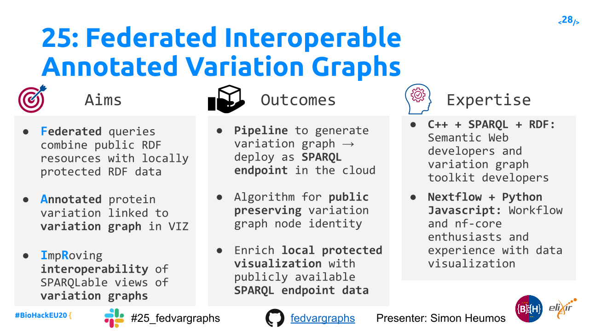
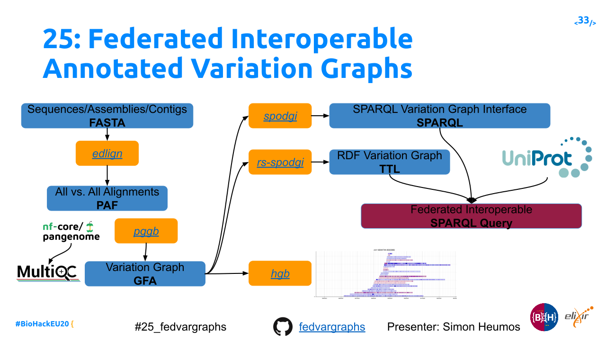
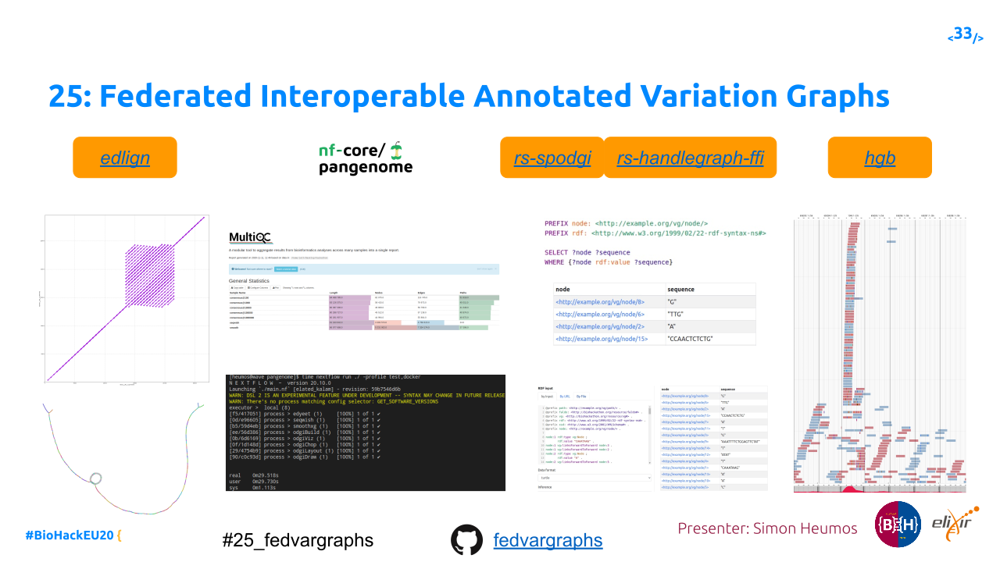
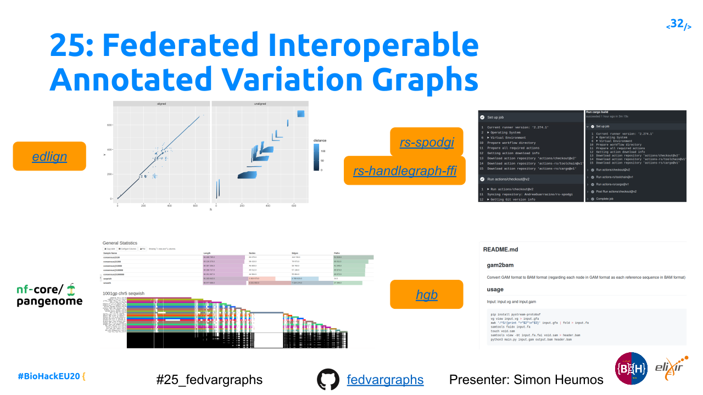

# Project 25: Federated Interoperable Annotated Variation Graphs

## Abstract

Variation Graphs are data structures that can accurately represent genetic variation in populations and across species. While avoiding inherent biases in linear reference genomes. We will use this hackathon to improve how variation graph tools can produce FAIRer data that is highly interoperable and reusable. We will engage with the (bio)container projects and workflow communities to present our computational outcomes as FAIR research objects. One major goal is to create an nf-core Nextflow DSL2 version of the pangenome graph build [`pggb`](https://github.com/pangenome/pggb) for the creation of pangenome graphs.

Interoperability will be improved by continuing work on SPARQLable views on highly compressed variation graph data structures. This engages with reusable annotation sources such as UniProt and others with SPARQL endpoints. At the same time, we will demonstrate how SPARQL federated queries can be used to interlink different variation graphs with a specific eye to secure access and public identifier stability.

Improving visualizations of genetic data in variation graphs will make it easier to access and understand complex structural variants as found in cancer cell lines as well as polyploid plant lines. Combining public available RDF/SPARQL resources with locally protected RDF/SPARQL data via federated SPARQL queries will result in a privacy-preserving visualization mechanism.
The annotated SARS-CoV-2 pangenome variation graph, produced during the virtual
biohackathon 2020 will be used as a critical research artifact to validate that our community's technology FAIRly captures genomic and proteomic information.

Using RDF/SPARQL as our interoperability layer allows us to work with key Elixir RIR and CDR resources such as Disgenet and UniProt, as well as ontologies like ChEBI and data sources like Phenopackets. Specifically, we will demonstrate federated queries with UniProt showing clinically annotated protein variation and link it back to the genome variation graph.

A discussion of already collected ideas can be found in the [`Federated Interoperable Annotated Variation Graphs`](https://docs.google.com/presentation/d/1FW7eF3BnpijHsCCLSXCb6Soz74v1JG6tb0nxflmVUIk/edit#slide=id.p) presentation.

## Topics

Cancer
 Containers
 Covid-19
 Data Platform
 Federated Human Data
 GA4GH partnership
 Interoperability Platform
 Marine Metagenomics
 Plant Sciences
 Human Pangenome Graph
 Nextflow

**Project Number:** 25

**EasyChair Number:** 39

## Team

### Lead(s)

Simon Heumos (simon.heumos@qbic.uni-tuebingen.de)* \
 Erik Garrison (erik.garrison@ucsc.edu) \
 Jerven Bollemann ([jerven.bolleman@sib.swiss](jerven.bolleman@sib.swiss)) \
 Toshiyuki Yokoyama (toshiyuki.t.yokoyama@gmail.com) \
 Lukas Heumos (lukas.heumos@posteo.net) \
 Philipp Ehmele (philipp_ehm@protonmail.com)

 *corresponding author

### Nominated participant(s)

Erik Garrison (erik.garrison@ucsc.edu) \
 Simon Heumos (simon.heumos@qbic.uni-tuebingen.de)

## Expected outcomes

1. Container to deploy a variation graph as a SPARQL endpoint on European cloud
 systems.
2. Example queries integrating datasets.
3. Linear time algorithm for public preserving variation graph node identity.
4. Demonstrate that we can enrich a local visualization of a privacy protected cancer sample with public available SPARQL endpoint data.

## Expected audience

1. SPARQL/RDF/Semantic Web developers
2. Variation graph toolkit developers
3. Workflow enthusiasts
4. Experience with data visualization using JavaScript

**Number of expected hacking days**: 4

## Building on the following projects

1. github.com/vgteam/libhandlegraph/
2. https://github.com/pangenome/spodgi
3. https://github.com/chfi/rs-handlegraph

## Projects we are working on

1. https://github.com/ekg/edlign 
2. https://github.com/pangenome/pggb
3. https://github.com/nf-core/pangenome
4. https://github.com/Imipenem/MultiQC/tree/module/odgi_stats/multiqc/modules/odgi
5. https://github.com/AndreaGuarracino/rs-spodgi
6. https://github.com/JervenBolleman/rs-handlegraph-ffi
7. https://github.com/6br/hgb

## Meeting minutes
For everyone to stay up to date we collect the current status of each day on [GDocs](https://docs.google.com/document/d/1wifM0Y58AWfCxQdqig3frlhUpyLvb74rNxVWOWQPZC0/edit?usp=sharing).

## Daily summary

### [Day 1 - Topics overview](https://docs.google.com/presentation/d/1tJYAHGJhYU4ui5bdPLBx27o0UiAAcxmCDlbi4PKihp8/edit#slide=id.ga722af1293_0_20)

### [Day 2 - Selected topics](https://docs.google.com/presentation/d/1sQkqPvT_QJXMwZk4d2GE0nWTpPpEmiK1tIlMdfeMtEQ/edit#slide=id.ga97d2fb217_0_1055)

### [Day 3 - Progress by topic](https://docs.google.com/presentation/d/19uWyuEmrXHpaUWds1Z-njAhRjh60JS7jU6jrJTDWRBU/edit#slide=id.ga8e2d573f7_0_181)

### [Day 4 - Progress by topic](https://docs.google.com/presentation/d/1f-_W0OxQwlzMie1maW7fmzBL2gHHvdneATH5CQ7eCDc/edit#slide=id.ga8e2d573f7_0_181)

### Day 5 - TO COME
