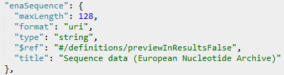
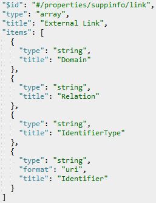

# Abstract

When sequencing molecules from an organism it is standard practice to create voucher specimens. This ensures that the results are repeatable and that the identification of the organism can be verified. It also means that the sequence data can be linked to a whole host of other data related to the specimen, including traits, other sequences, environmental data, and geography. It is therefore critical that explicit, preferably machine readable, links exist between voucher specimens and sequence. However, such links do not exist in the databases of the International Nucleotide Sequence Database Collaboration (INSDC). If it were possible to create permanent bidirectional links between specimens and sequence it would not only make data more findable, but would also open new avenues for research. In the Biohackathon we built a semi-automated workflow to take specimen data from the Meise Herbarium and search for references to those specimens in the European Nucleotide Archive (ENA). We achieved this by matching data elements of the specimen and sequence together and by adding a “human-in-the-loop” process whereby possible matches could be confirmed. Although we found that it was possible to discover and match sequences to their vouchers in our collection, we encountered many problems of data standardization, missing data and errors. These problems make the process unreliable and unsuitable to rediscover all the possible links that exist. Ultimately, improved standards and training would remove the need for retrospective relinking of specimens with their sequence. Therefore, we make some tentative recommendations for how this could be achieved in the future.

# 1. Introduction

When molecules are sequenced from an organism it is best practice to create voucher specimens [@PLEIJEL2008369; @10.1111/jai.12568]. This ensures that the results are repeatable and that the identification of the organism can be verified. It also means that other information, that perhaps do not fit within the data model for sequences, can still be made available, linked to the specimen [@10.1128/mBio.02698-20]. These specimen vouchers are often kept in herbaria and museums where they are curated and stored for the long-term. Similarly, DNA is also extracted from ancient specimens that have been collected and stored in collections, perhaps from before sequencing technologies were even available. In both cases, it is important to be able to know all sequences extracted from a specimen, as well as find the specimen from which a sequence has been extracted. Yet currently, connecting specimens to sequences is difficult without considerable manual detective work. To a researcher with expertise, specimens are identifiable by the details of the collection event, such as date, location, collector, collector number, and taxonomic name. They may also be referenced by accession numbers, such as barcodes attached to the specimen. However, these fields are mostly unformatted text strings in a database record and there is little-to-no consistency between these data in specimen and sequence databases.

Still, the situation does not have to be this way. Databases of the [International Nucleotide Sequence Database Collaboration](http://www.insdc.org/) (INSDC), such as the [European Nucleotide Archive (ENA)](https://www.ebi.ac.uk/ena/browser/home), have identifiers for sequences, as do many specimens [@10.1093/database/bax003]. It would be possible to create bidirectional links to connect these data permanently and in a machine readable way. Ideally, this would be done when these database entries are created, but this will require changes to the data standards, databases and procedural change for researchers, collections and their institutions. Yet, even if we can resolve the challenges of future data, there still remains a large legacy of unconnected sequences that need connecting to their vouchers.

At the Biohackathon we attempted to build a semi-automated workflow that would take specimen data from the Meise Herbarium and search for references to those same specimens in a DNA sequence database. We took advantage of matching elements of the specimen and sequence data, such as date, location, collector, collector number and taxonomic name. As these data are not necessarily in the same format, we experimented with ways to match these data indirectly.

 Our aims for the BioHackathon-Europe 2020 were…

1. To analyze the types of data available in databases suitable for linking specimens to sequences.
2. To create scripts to match existing data and evaluate how successful we are.
3. To make recommendations on how specimen and sequence databases should be connected in the future.

Ultimately, these outcomes will help any collection connect its data better and will support the Elixir (https://elixir-europe.org/) goals of improving human and machine readable access to all data in the biological sciences.

## 1.1 Methodological Approach

The [European Nucleotide Archive (ENA)](https://www.ebi.ac.uk/ena/browser/home) and other sequence databases follow standards such as [Minimum Information about any (x) Sequence (MIxS)](https://gensc.org/mixs/) created by the Genomic Standards Consortium. Specimen databases generally follow the standards, Darwin Core [@10.1371/journal.pone.0029715] or ABCD [@10.1080/11263504.2012.740085]. These standards define terms for the data that describe the sequence or specimen and their origins. However, many of these terms require only free text content and the terms do not necessarily map interoperably between standards. Our approach is to mine these text strings for related common elements in associated sequences and specimens and use our knowledge of our collections to link them together.

For example, the Meise [herbarium](https://www.botanicalcollections.be) has been working towards connecting all the people associated with specimens, such as collectors and identifiers, to stable identifiers, such as [ORCID](https://orcid.org/) IDs [@10.1093/database/baaa072]. If we are able to match a person name in the metadata of a sequence to a stable identifier, such as an [ORCID](https://orcid.org/) ID, we can narrow the search of specimens and sequence considerably. We can also make use of the power of [Wikidata](https://www.wikidata.org/) as a broker of person identifiers, so that if we have one identifier in one database, we can use Wikidata to find other identifiers and use the full suite of identifiers to search the other database.

Data on the specimens of Meise Botanic Garden can be accessed in various ways. There is a portal to the database where users can view high resolution pictures of specimens and download data ([botanicalcollections.be](https://www.botanicalcollections.be/)). However, for machine access to data the simplest entry point is the [Global Biodiversity Information Facility (GBIF)](https://www.gbif.org/). We made extensive use of the [GBIF API](https://www.gbif.org/developer/summary) in our workflow as it provides rapid access to data from hundreds of millions of specimens and to the unified GBIF Taxonomic Backbone [@10.15468/39omei].

We also made use of [Wikidata](https://www.wikidata.org/) as an information broker. Wikidata does not hold much data about molecular sequences or specimens, however it does hold many identifiers for other entities, such as people and taxa. This allows it to act as a bridge between those databases.

Figure 1. A diagram of the connections between sequence databases (e.g. ENA) and specimens (GBIF). Sequences and specimens are often cited in literature and biological databases. These can be used as a source of accession numbers, locations, dates, person names and taxa with which sequence and specimen data can be linked. Wikidata can be used as a broker to link identifier schemes, such as taxon IDs. Even though candidate matches between sequences and specimens can be found uncertainty often remains. Therefore, we have foreseen a human verification step to confirm matches before the results are stored as a digital object that combines the results.

Scripts and data used in this Biohackathon, as well as a Django app, can be found in the [GitHub repository](https://github.com/elixir-europe/BioHackathon-projects-2020/tree/master/projects/33).

## 1.2 Other Approaches

The methodology behind the main outcome of this Biohackathon is described in section 2. However, some other approaches to finding candidate sequences were explored. These were not fully completed by the end of the Biohackathon or were deemed unfeasible, but nevertheless raise important questions about the linking problem.

### 1.2.1 References in the literature

One of the possible approaches to find the links is by parsing the information from literature. The feasibility of this approach was investigated by analysing some of the papers that were known to contain specimens from Meise Botanic Garden. Several issues were identified:
Data about the specimen vouchers and their sequences can sometimes be found inside the body of the publication, but is often in the supplementary files.
Information can be found inside the body text of the paper or inside tables.
The file format of the supplementary information varies between journals, with different conventions and between authors. 
The authors rarely use stable identifiers for specimens.
Although there is an enormous amount of information hidden inside these articles, this task was considered too time consuming during the project. However, this approach has potential and should be pursued.

### 1.2.2 Fuzzy matching

A large dataset of around 6 million sequence records was mined from the ENA API using an R script and parsing from XML to a tabular format. This dataset included every sequence which had any value in the `specimen_voucher` field. This allowed us to identify the fields that are commonly populated, and those that could be further investigated for linking to specimen data. A  preliminary visualisation was made using the visdat package (Figure 2) [@10.21105/joss.00355].

Figure 2: Presence and absence of data for sequences were assessed for a subset of 1M (random) sequences out of the 6M records. Only `specimen_voucher` and `tax_id` were always present, the former by constraints of the API query.

The `specimen_voucher` field in ENA is intended to contain a triple of institution-code, collection-code and specimen_id (e.g. `APM:BR:BR0000025959222V`). When examining this larger dataset of accessions it became evident that the `specimen_voucher` was often populated with other identifying numbers in use within the Botanic Garden, though often in a non-standard format. Patterns we noticed included the removal of leading zeros, the appending of collector names to catalogue numbers, and the removal of other leading or trailing numbers. To compensate for these adaptations we tried a fuzzy matching technique by calculating the optimal string alignment distance between the values in the `specimen_voucher` field of the ENA data, and the catalogue numbers and record numbers published in our own dataset published on GBIF [@10.15468/dl.tfn5q2]. 

When only accounting for the removal of a maximum of two digits, the algorithm resulted in several orders of magnitude more matches between ENA records and GBIF records than non-fuzzy matching between the same datasets (see section 2), however, further manual inspection revealed a high false-positive rate. This method shows promise, but requires significant fine tuning and further processing to make it effective.

### 1.2.3 Mining lab notebooks

The digital notebooks of the Botanic Garden’s laboratory include information regarding the initial determination of the samples, identifying markers used internally in the laboratory, as well as the names of the collecting scientist and researcher requesting the analysis and other information regarding the sequencing. However, as the data were not consistently provided in the notebooks, it became clear that there was little hope of finding the corresponding data from the ENA database without a time-consuming intensive data cleaning exercise.

# 2. Methods

## 2.1. Finding candidate sequences

To access sequence data, queries were made to the [ENA portal API](https://www.ebi.ac.uk/ena/portal/api/) attempting to select sequence records potentially related to voucher specimens from the herbarium collection of [Meise Botanic Garden](https://www.botanicalcollections.be). ENA also contains data on samples that sequences have been derived from, but similar searches to those conducted on sequences resulted in far fewer results for samples. Most sequences (98%) appeared unassociated with samples, because the `sample_accession` field of the sequence was empty. We focused on those sequences with the `specimen_voucher` data field populated. Other fields like `description` threw many false positives with our querying approach and rarely contained identifiers of interest. All query work was done in R, a script called `bh-apicalls.R` available in this repository.

Different query approaches were tried. Initially, multiple queries were specified combining wild cards (\*) and common terms associated with Meise Botanic Garden. For example, the internationally recognised herbarium code for the herbarium of Meise Botanic Garden is `BR` (see [Index Herbariorum](http://sweetgum.nybg.org/science/ih/)).
The query values are listed below:

||||
|---|---|---|
|`*br)*` || `*br-*`|
|`*br:*` || `*meise*`|
|`*br<*` || `*gard.*belg*`|

These values mostly use the code `BR`, adding punctuation characters to omit false-positives as the API’s queries are not case sensitive. Nor does the ENA API support regular expressions. To work around this, a query was made for the more generic `*b*` (i.e. all sequences with a b in their `specimen_voucher` field). A more generic any value query for this field (i.e. `*`) was attempted, but came with performance issues (both at the API response and the local memory side) and was only successful too late in the Biohackathon for it to be used in the workflow described here (see section 1.2.2.). The exported results from this general `*b*` query were then mined using more specific regular expressions, including (other than those previously listed):

||||
|---|---|---|
|`br[0-9]{13}`||`br [0-9]{13}`|

These fit the pattern of Meise Botanic Garden specimen barcodes, which are used as catalogue numbers. Regular expressions were also used to eliminate some false-positives, in particular acronyms that contained BR but also contained other upper case characters (i.e. using a negative grep for `[A-Z]BR`). A few sequences were found using the `*meise*` query, which had not been found in the `*b*` query. These were added to the results from the mining approach of the `*b*` query. Using this method, an eventual result was obtained of 8,398 sequences. 5,920 were left after eliminating the false-positives. Subsequently, for all of these results we attempted to identify collector numbers and collector names within the `specimen_voucher` string from ENA.

## 2.2 Mining the results for specimen properties

The recommended format for [`specimen voucher`](https://www.ebi.ac.uk/ena/WebFeat/qualifiers/specimen_voucher.html) is a so called Darwin Core triplet of `institutionCode:collectionCode:id`, but this recommendation has not always been followed in our institution. More often, beyond a reference to the institution as described above (i.e. BR or Meise), the specimen is only described through a combination of the name(s) of the person(s) who collected it and a number the collector generated. This (alpha)numeric identifier can be the so-called `collector number`, which is often given to a botanical specimen during the collection event or shortly after, to differentiate it from other specimens collected by the same individuals on the same date. The numeric identifier may also be the unique accession number that disambiguates the specimen from all others in the collection. It is not uncommon for this identifier to be only partially present in the `specimen_voucher` field. For example, the non-numeric part may be omitted or it may be stripped of leading zeroes. It is also not uncommon for multiple numeric identifiers to be present in the `specimen voucher` field.

To match the numeric identifiers found in the ENA sequence metadata to numbers known for Meise’s herbarium specimens, the numbers were extracted by splitting the `specimen voucher` string into substrings divided by spaces. Out of each substring that contained at least one number, the numeric elements were extracted to avoid ambiguity through punctuation. For example, a `specimen_voucher` value of `De Block 6 (BR)(Meise 77-0360)` would result in two substrings of `6` and `770360`.

To match person names, the surnames of people listed in Meise Botanic Garden’s list of known collectors (see the data file `meise-coll.txt`) were matched to the whole `specimen_voucher` string. Any positive match was accepted and the persistent identifiers (PIDs) associated with that record in the collector list were linked to the ENA sequence metadata.

Finally, the ENA provided `tax_id` - an [NCBI](https://www.ncbi.nlm.nih.gov/taxonomy/) taxon id - was matched to the [GBIF](https://www.gbif.org/) backbone taxon ID using Wikidata as a broker [@10.15468/39omei]. This was done using a series of SPARQL queries. This way, the taxon names for ENA sequences could be unambiguously linked to taxon names for specimens in GBIF.

## 2.3 Matching to specimen data

Subsequently, a matching process was set up, whereby a positive link between a specimen published to GBIF and an ENA sequence was confirmed if there was a match between all of the following: 

* taxon ID on ENA and taxonKey in the GBIF Backbone
* one of the numeric elements in the ENA `specimen_voucher` field and the numeric element of `recordNumber` on a specimen record in GBIF
* one of the PIDs connected to the ENA record and `recordedByID` in GBIF. 

GBIF has an [API](https://www.gbif.org/developer/summary), but the matching was performed locally using the GBIF-generated occurrence file of the Meise Botanic Garden Herbarium dataset [@10.15468/wrthhx]. This way, the overhead of using an API was avoided and manipulations such as extracting only numeric elements was possible.

## 2.4 Human-in-the-loop verification of matches

Candidate matches between sequences on GBIF and sequences on ENA were envisaged to be processed through an online application whereby a user could compare the metadata of the two entities. They would then confirm in the application that they agreed that both the sequence and the specimen had a common origin. During the Biohackathon a Django app was developed to demonstrate the possibility. Matches could be imported in a JSON format and combined with additional metadata from both ENA and GBIF to better inform the user. In the future, such an app could export validated matches in a standardized JSON format. This export could subsequently be used to annotate the GBIF records with their correct ENA sequence, or vice versa. 

## 2.5 Update of Digital Specimens

Voucher specimens can be represented digitally as a digital object (DO)[@10.3390/publications8020021]. A standard for such objects is currently under development within the [DiSSCo](https://www.dissco.eu) (Distributed System of Scientific Collections) research infrastructure, called [openDS](https://github.com/DiSSCo/openDS) (Open Digital Specimen)[@10.3897/rio.6.e54280]. When sequences are successfully linked to specimens as outlined in this hackathon, these links can be represented as part of the DO. Publishing these links to the DO requires a standardized `UPDATE` operation through the Digital Object Interface Protocol (DOIP). The technological components of this DO infrastructure have not been fully developed, although a [demonstrator](https://nsidr.org) does exist where some specimens from Meise Botanic Garden herbarium are already present. In openDS, links could be modelled in multiple ways, as can be seen in figures 3 and 4. Only the first, specific schema is currently supported in the demonstrator. DOIP operations have also not been set up properly yet, so an effective demonstration was not yet feasible.

 

# 3. Results and Discussion

Through this process, 1,336 ENA sequences were connected to at least one GBIF record. The results can be found in this project’s repository, under `data/matchids.json`. This approach only considered herbarium specimens available on GBIF. Further work is needed to link living accessions and unpublished specimens. A particular class of specimens are those that were collected from living accessions in the Garden. These are currently not published to GBIF, in part because their metadata do not fit well into the Darwin Core standard used on GBIF. Many of these specimens have two gathering events: the original gathering indicating its provenance and the secondary gathering from the place it was cultivated in the Garden.

Reconnecting the links between objects and the data derived from them is inefficient, error prone and expensive. Indeed, if rigorous data management procedures were followed it would not be necessary. Considerable work needs to be done to improve scientific procedures, infrastructural standards and scientific data management culture. Much of the follow-up work that needs to be done is to make these changes, so that there will be no need to reconnect vouchers and their data in the future. Furthermore, subsamples from specimens may be sequenced in institutions unrelated to the institution storing the specimen and therefore the scientist may be unaware of accessioning practise.

While we have demonstrated that a workflow is conceivable to retrospectively link molecular sequences and their voucher specimens. By adding a human-in-the-loop stage we could engage scientists to help us in the linking process, though this would only be possible for those scientists we could contact and who would be willing. 

# 4. Conclusions

Ultimately, a much better process would be if specimens and sequence were linked stably from their creation [@10.1093/biosci/biz140]. This would require both entities to have persistent identifiers and that those identifiers could, if necessary, be retrospectively added to each record. Various things stand in the way of making this a reality. For example, there is often a long lag time between a specimen entering a collection and it being accessioned with an identifier and also, scientists documenting specimens lack training, making them unaware of appropriate standards. Part of the problem may be that there is little peer review of data underlying publications [@10.1175/BAMS-D-13-00083.1]. Nor are there appropriate incentives to motivate scientists to care for their legacy data [@10.1016/j.tree.2013.05.002].

Based upon our experiences during the Biohackathon-Europe 2020 we make several recommendations to improve the current situation. Nevertheless, these recommendations would take some considerable effort to implement and disseminate, therefore they need prioritization by institutions.

## For INSDC partner databases

Databases should incorporate PIDs into their data model for…

* people (i.e. [ORCID](https://orcid.org/))
* institutions (i.e. [ROR](https://ror.org/scope))
* publications (i.e. [DOI](https://www.doi.org/))
* and specimens (see [@10.1093/database/bax003])

## For collections

* Scientists depositing sequence data should be given training on the data model and standards used.
* Collections should make more effort to reconnect their backlog of voucher specimens to their sequences.
* Specimens should obtain a PID at the earliest point possible upon collection and certainly before tissue collection for sequencing.
* Novel data encapsulation approaches are needed to ensure that the links between these data can be transversed by people and by machines.

# 5. Acknowledgements

The authors thank the organizers BioHackathon-Europe for their support and the smooth running of the event. QG, PH, MD, MT were supported by SYNTHESYS+ a Research and Innovation action funded under H2020-EU.1.4.1.2. Grant agreement ID: 823827 and by DiSSCo Prepare H2020-INFRADEV-2019-2020 – Grant Agreement No. 871043. We would also like to thank Alex Hardisty, Steven Janssens, Sofie Meeus, Niels Raes and Claus Weiland for joining our discussions during the hackathon.

# 6. References
